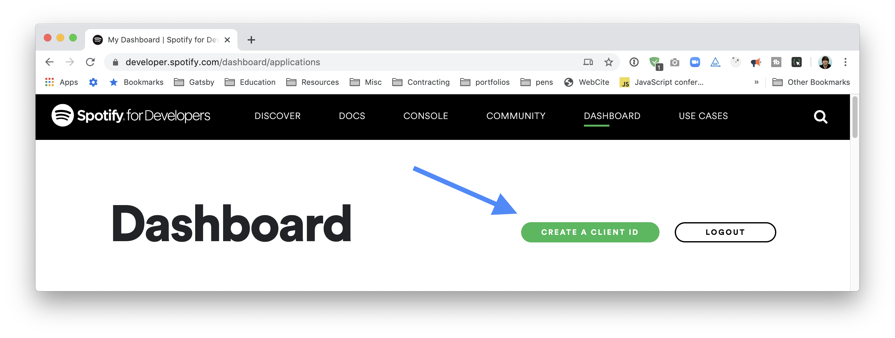

# Redux workshop - Spotify client

Today's workshop will see us build an application using _real data_ from the Spotify API:


This is an application designed for _mobile browsers_. It features:

- Showing details about an artist (avatar, # of followers, genre tags…)
- Loads the top 3 tracks, can play a short sample of each
- Links to related artists, to load the same view for a related artist

## Working with APIs

There are many third-party APIs that let us build rich applications on top of them:

- You can use the Google Maps API to embed a live map on your site
- You can use the Instagram API to display photos from Instagram
- You can use various sports APIs to build analytics apps based on sports data.

The way that they typically work is they expose a set of "REST endpoints". This is very similar to the endpoints you built while working on the Twitter project!

The trickiest part of working with third-party APIs is _authentication_. APIs don't want strangers to abuse their services, so they enforce that you register for a _key_ and use that key on all requests.

First order of business is registering for a Spotify API key.

### Registering an API key

First, you'll need a Spotify account. If you don't already have one, you can create one for free at this URL: https://www.spotify.com/signup

After you have an account, navigate to the Dashboard login screen: https://developer.spotify.com/dashboard/login. Log in with your new account.

The very first time you do this, you'll need to agree to the terms of service.

We need to create an "app". Essentially, we need to tell Spotify what we want to do with its API. In return, it will give us some API keys we can use.



Enter something like the following:


You'll be asked if this is a commercial or non-commercial application. Select **non-commercial**.


Afterwards, you should be taken to the app's home screen. This page will give us our Client ID and our Secret (we'll need to click "Show client secret" to reveal it):


### Storing keys

Create a new file in the root `workshop` directory named `.env`. Copy and paste this into it:

```
SPOTIFY_CLIENT_ID=YOUR_KEY_HERE
SPOTIFY_SECRET=YOUR_KEY_HERE
```

Replace "YOUR_KEY_HERE" with the keys provided from Spotify

### Avoiding source control

**It is very important** that you not commit this `.env` file into git - otherwise, it will show up on Github. Bad actors run scripts that search Github for exposed private keys. If they find yours, they'll use it for nefarious purposes, and you'll get banned from using the Spotify API.

You can tell git not to track certain files in the `.gitignore`.

If you open `workshop/.gitignore`, it should include this:

```
// Lots of stuff omitted

# misc
.DS_Store
.env
.env.local
.env.development.local
.env.test.local
.env.production.local
```

Because we've already added `.env` to this file, git won't try and commit it. No action is needed on your part, but it's important to be mindful of this on other projects. Always add your "secrets" to gitignore.

## Understanding the initial state of the workshop

Inside `/workshop`, you'll see that we have a typical boilerplate setup for a React application.

We also have a `server` folder.

We need a Node server for 1 very specific reason: to generate access tokens for the Spotify API.

Here's how authentication works:

1. You sign up for a Client ID and API secret from Spotify (✔ we did this already)
2. Whenever the user loads our app, we'll want to use the Client ID and API secret to generate an "access token".
3. We'll use that access token to prove to Spotify that we are allowed to access certain resources.

_Why can't we send the API secret directly to Spotify?_ It might strike you as curious that we need to use our API secret to request an access token. What's the difference?

## Running

You can run both the client and the server by running `yarn start` inside the `workshop` directory.

## Setup

We have a few small tasks to do to finish setting up the initial project.

### Add Google Fonts

This project uses Montserrat, font weights 400, 600, and 800.

Go to https://fonts.google.com/ and get an embed snippet for this font. Add it to your page.

_HINT:_ should be a `<link>` tag. You'll want to copy/paste the snippet they give you into `public/index.html`

### Set up the proxy

We have a server-side component, and we need to proxy requests on the front-end.

Add this line to your `package.json`:

```
"proxy": "http://localhost:5678",
```

### CSS Reset

Create a new component, `GlobalStyles`, and add in some global styles using styled-components `createGlobalStyles`.

Up to you exactly what you'd like to add, but it's recommended that you add at least this:

```css
html,
body,
div,
span {
  margin: 0;
  padding: 0;
  border: 0;
  vertical-align: baseline;
}

/* GLOBAL STYLES */
*,
*:before,
*:after {
  box-sizing: border-box;
  -webkit-font-smoothing: antialiased;
  font-family: Montserrat, sans-serif;
}
```

## Exercise 1 – Server setup

We have a Node server that exists to connect to Spotify and produce an access token for the client.

If you open `server/server.js`, you'll see that we have an express endpoint, `app.get('/spotify_access_token')`. We'll want to hit this endpoint from our client.

For now, let's test using Insomnia. The server runs on port 5678, so you can make a GET request to `localhost:5678/spotify_access_token`. For now, you should get the following response:

```
{ todo: true }
```

As a stretch, see if you can work out how to complete this endpoint, given the following pieces of information:

1. Spotify's documentation can be found here: https://developer.spotify.com/documentation/general/guides/authorization-guide/#client-credentials-flow

- Be sure to read the instructions for "Client Credentials flow". Ignore the other flows

2. You can use `isomorphic-fetch`, an NPM package installed to this project, to use the familiar `fetch` API in Node.js. Import the package, and you'll be able to use fetch normally:

- `const fetch = require('isomorphic-fetch')`

3. You'll want to send the following headers:

```
{
  'Authorization': `Basic ${authString}`,
  'Content-Type': 'application/x-www-form-urlencoded',
};
```

Spend between 5-10 minutes seeing if you can combine these pieces into an endpoint that returns the access token when you make a request to the server with Insomnia.

.
..
...
....
.....
......
.......
........
.......
......
.....
....
...
..
.
..
...
....
.....
......
.......
........
.......
......
.....
....
...
..
.
..
...
....
.....
......
.......
........

Here's what your endpoint should look like:

```js
app.get('/spotify_access_token', async (req, res, next) => {
  const clientId = process.env.SPOTIFY_CLIENT_ID;
  const clientSecret = process.env.SPOTIFY_SECRET;

  // We need, annoyingly, a base64-encoded string of our id:secret, for spotify.
  // We can use Buffers to do this for us.
  const authString = Buffer.from(clientId + ':' + clientSecret).toString(
    'base64'
  );

  const response = await fetch('https://accounts.spotify.com/api/token', {
    method: 'POST',
    headers: {
      Authorization: `Basic ${authString}`,
      'Content-Type': 'application/x-www-form-urlencoded',
    },
    body: 'grant_type=client_credentials',
  });

  const json = await response.json();

  return res.send(json);
});
```
